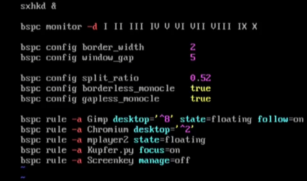
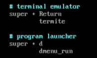
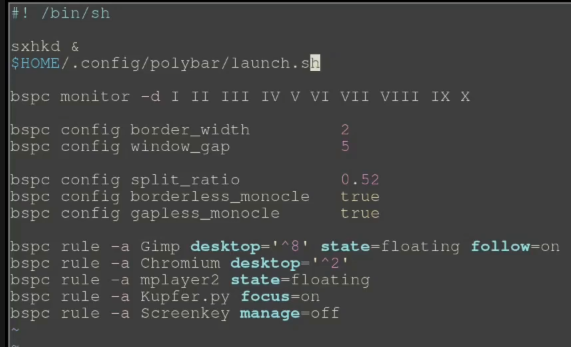

# bspwm-installation-guide
#### Tutoriel basé sur celui de TDLM: https://youtu.be/uiJasZWXumk


On installe d'abord toutes les nécessités
```shell 
sudo pacman -Syy bspwm sxhkd kitty nitrogen picom lightdm lightdm-gtk-greeter firefox pcmanfm dmenu xorg
```
Si on vous dit que termite n'est pas trouvé, vous pouvez prendre une alternative.
termite est votre terminal, mais il en existe d'autres comme kitty, qterminal ou bien alacritty.

On va créer les fichiers config qui contient les règles de nos outils. On va du coup pouvoir les modifier et customiser à notre guise notre affichage avec ces fichiers

On crée les répertoires qui contiennent les fichiers config
```shell
mkdir .config
mkdir .config/bspwm
mkdir .config/sxhkd
mkdir .config/polybar
```

On copie ensuite les modèles de fichier config donnés dans ce repertoire qu'on vient de créer
```shell
cp /usr/share/doc/bspwm/examples/bspwmrc .config/bspwm
cp /usr/share/doc/bspwm/examples/sxhkdrc .config/sxhkd
```

On va éditer les règles de bspwmrc pour ajouter l'éxecution de sxhkd au début

```shell
vim .config/bspwm/bspwmrc
```

Vous devriez avoir quelque chose comme ça:


Et maintenant on va modifier le fichier de notre package qui gère les hotkeys, sxhkd.
Vous pouvez ajouter également vos propres hotkeys, personnellement je vais simplement changer ça (sur l'image).
Mettez évidemment un terminal que vous avez. Vous pouvez utiliser termite, 
```shell
vim .config/sxhkd/sxhkdrc
```

Voilà pour moi:



Maintenant on va activer lightdm, notre gestionnaire de session, dans notre systemctl de sorte à ce qu'il se lance automatiquement au lancement du système
```shell
sudo systemctl enable lightdm
```

On peut rebooter pour que tout se lance proprement, et arriver sur notre bspwm tout neuf
```shell
reboot
```
Connectez vous, choissisez bspwm en window manager et nous devriez arriver sur un écran noir.

Ouvrez un terminal.
Utilisez votre hotkey que vous avez créé dans le fichier configuration de sxhkd.
```shell
xrandr -s 1920x1080
```

Installation de yay
```shell
sudo pacman -S git
sudo git clone https://aur.archlinux.org/yay-git.git
sudo chown -R tecmint:tecmint ./yay-git
cd yay-git
makepkg -si
```

Installation de polybar
```shell
cd
yay -S polybar
cd .config/polybar
vim launch.sh
```

Contenu de launch.sh :
```shell
#!/bin/bash

# Terminate already running bar instances
killall -q polybar

# Wait until the processes have been shut down
while pgrep -u $UID -x polybar > /dev/null; do sleep 1; done

# Launch Polybar, using default config location ~/.config/polybar/config.ini
polybar example &

echo "Polybar launched..."
```

```shell
cp /usr/share/doc/polybar/examples/config.ini .
chmod +x launch.sh
cd
vim .config/bspwm/bspwmrc
```

Ajouter cette ligne en dessous de sxhkd &:
> $HOME/.config/polybar/launch.sh


```shell
sudo pacman -S arandr
```

Lancez arandr
Crée une window.sh (blue icon)
Une fois créée, vous pouvez fermer arandr

vim .xprofile
xprofile contents:
```shell
# wallpaper
nitrogen --random --set-zoom-fill &

# compositor
picom -f &

# screen resolution
xrandr --output Virtual-1 --primary --mode 1920x1080 --pos 0x0 --rotate normal
```

Fermez votre session.
Ctrl + Alt + Suppr

Reconnectez-vous.
```
sudo pacman -S archlinux-wallpaper
```

Lancez nitrogen.
Cliquez sur préférences et ajouter un répertoire contenu vos fonds d'écrans. Par exemple:
>/usr/share/backgrounds/REPERTOIRE

Vous pouvez ajouter une option comme fill screen, qui adapte l'image à la taille de l'écran par exemple.